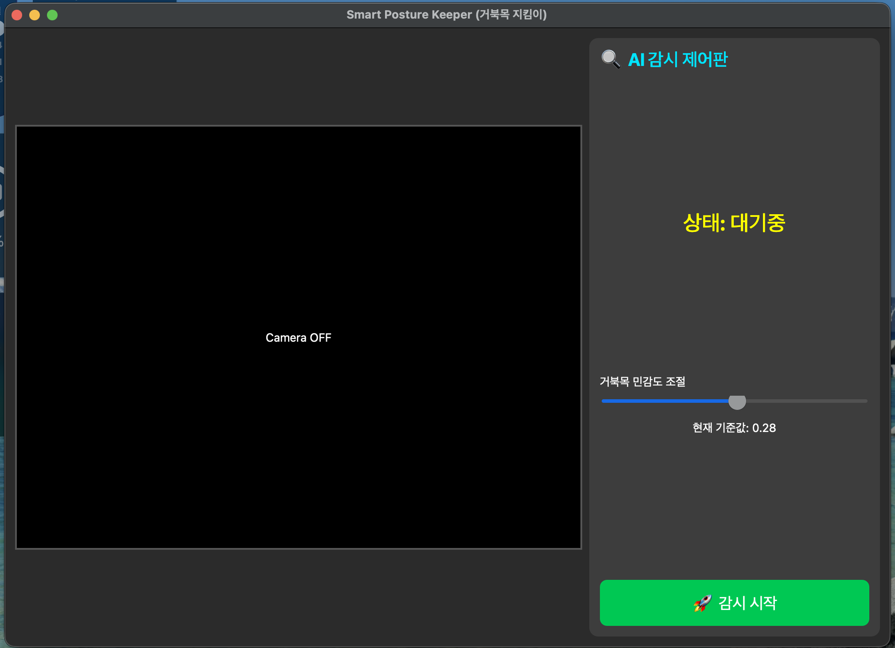
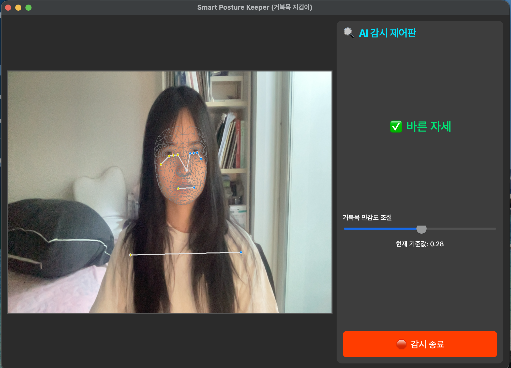
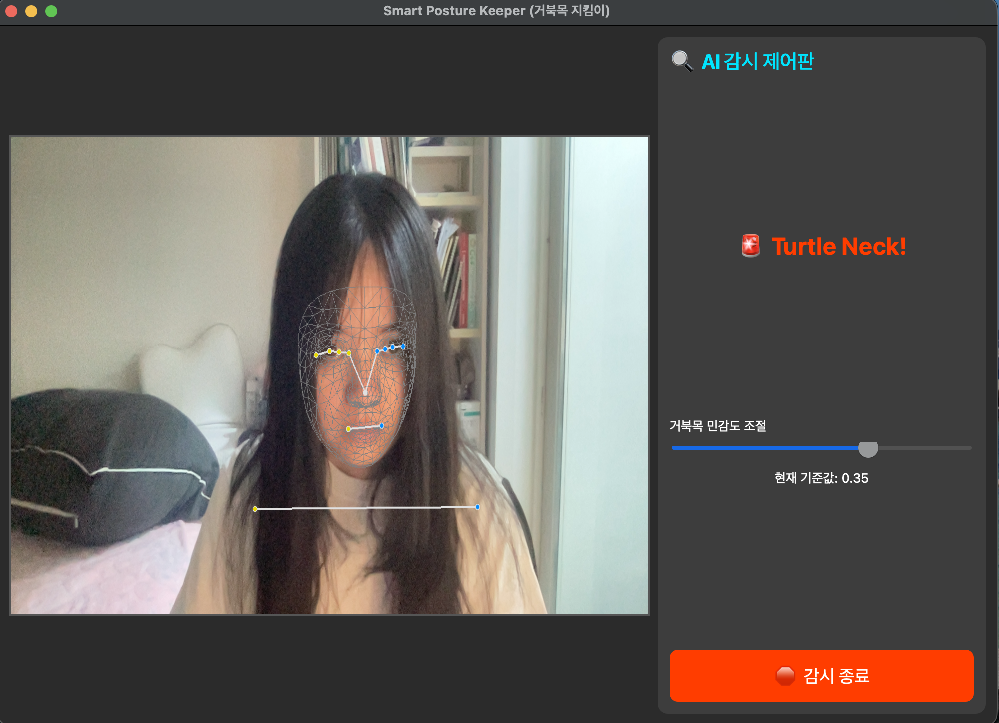
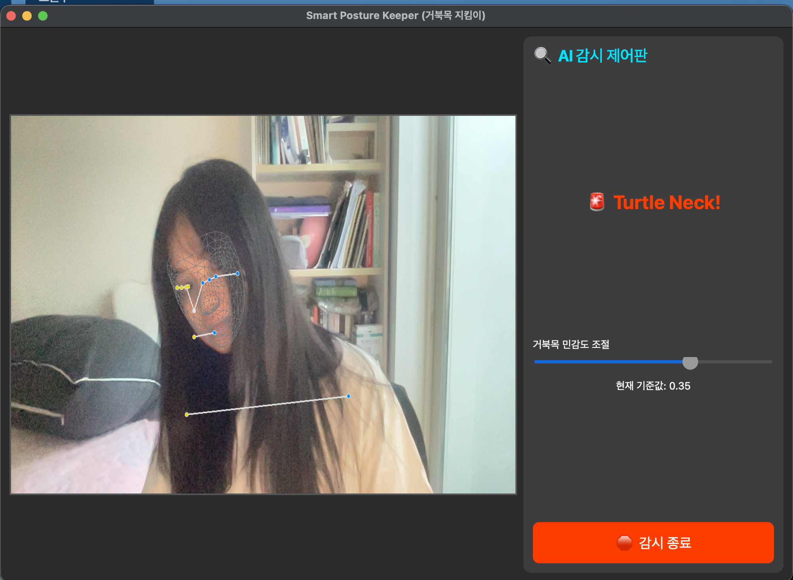
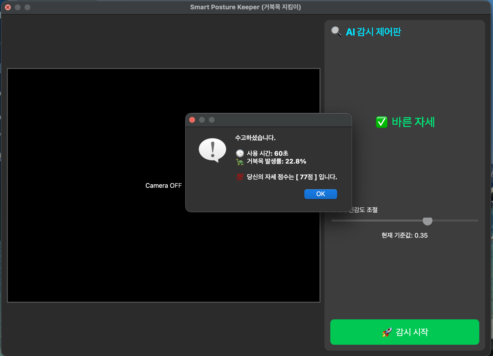

{\rtf1\ansi\ansicpg949\cocoartf2867
\cocoatextscaling0\cocoaplatform0{\fonttbl\f0\fswiss\fcharset0 Helvetica-Bold;\f1\fnil\fcharset0 AppleColorEmoji;\f2\fnil\fcharset129 AppleSDGothicNeo-Bold;
\f3\fswiss\fcharset0 Helvetica;\f4\fnil\fcharset129 AppleSDGothicNeo-Regular;}
{\colortbl;\red255\green255\blue255;}
{\*\expandedcolortbl;;}
\paperw11900\paperh16840\margl1440\margr1440\vieww22280\viewh14360\viewkind0
\pard\tx566\tx1133\tx1700\tx2267\tx2834\tx3401\tx3968\tx4535\tx5102\tx5669\tx6236\tx6803\pardirnatural\partightenfactor0

\f0\b\fs36 \cf0 # 
\f1\b0 \uc0\u55357 \u56354 
\f0\b  Smart Posture Keeper (
\f2 \'b0\'c5\'ba\'cf\'b8\'f1
\f0  
\f2 \'c1\'f6\'c5\'b4\'c0\'cc
\f0 )\

\f3\b0 \
\
\
\
\
\

\f1 \uc0\u55357 \u56534 
\f3  
\f4 \'c7\'c1\'b7\'ce\'c1\'a7\'c6\'ae
\f3  
\f4 \'bc\'d2\'b0\'b3
\f3 \

\f4 \'c7\'f6\'b4\'eb\'c0\'ce\'c0\'c7
\f3  
\f4 \'b0\'ed\'c1\'fa\'ba\'b4\'c0\'ce
\f3  \'93
\f4 \'b0\'c5\'ba\'cf\'b8\'f1
\f3  
\f4 \'c1\'f5\'c8\'c4\'b1\'ba
\f3 (Turtle Neck Syndrome)\'94
\f4 \'c0\'bb
\f3  
\f4 \'bf\'b9\'b9\'e6\'c7\'cf\'b1\'e2
\f3  
\f4 \'c0\'a7\'c7\'d1
\f3  AI 
\f4 \'b1\'e2\'b9\'dd
\f3  
\f4 \'bd\'c7\'bd\'c3\'b0\'a3
\f3  
\f4 \'c0\'da\'bc\'bc
\f3  
\f4 \'b1\'b3\'c1\'a4
\f3  
\f4 \'c7\'c1\'b7\'ce\'b1\'d7\'b7\'a5\'c0\'cc\'b4\'d9
\f3 .\

\f4 \'c0\'a5\'c4\'b7\'c0\'bb
\f3  
\f4 \'c5\'eb\'c7\'d8
\f3  
\f4 \'bb\'e7\'bf\'eb\'c0\'da\'c0\'c7
\f3  
\f4 \'c0\'da\'bc\'bc\'b8\'a6
\f3  
\f4 \'bd\'c7\'bd\'c3\'b0\'a3\'c0\'b8\'b7\'ce
\f3  
\f4 \'ba\'d0\'bc\'ae\'c7\'cf\'b0\'ed
\f3 , 
\f4 \'b0\'c5\'ba\'cf\'b8\'f1
\f3  
\f4 \'c0\'da\'bc\'bc\'b3\'aa
\f3  
\f4 \'c1\'b9\'c0\'bd\'c0\'cc
\f3  
\f4 \'b0\'a8\'c1\'f6\'b5\'c7\'b8\'e9
\f3  
\f4 \'c1\'ef\'bd\'c3
\f3  
\f4 \'be\'cb\'b8\'b2\'c0\'bb
\f3  
\f4 \'c1\'a6\'b0\'f8\'c7\'d1\'b4\'d9
\f3 .\

\f4 \'bb\'e7\'bf\'eb\'c0\'da\'ba\'b0
\f3  
\f4 \'b8\'c2\'c3\'e3\'c7\'fc
\f3  
\f4 \'b0\'a8\'b5\'b5
\f3  
\f4 \'c1\'b6\'c0\'fd
\f3  
\f4 \'b1\'e2\'b4\'c9\'c0\'bb
\f3  
\f4 \'c1\'a6\'b0\'f8\'c7\'cf\'b8\'e7
\f3 , \

\f4 \'c0\'cf\'c0\'cf
\f3  
\f4 \'c0\'da\'bc\'bc
\f3  
\f4 \'b8\'ae\'c6\'f7\'c6\'ae
\f3  
\f4 \'b1\'e2\'b4\'c9\'c0\'bb
\f3  
\f4 \'c5\'eb\'c7\'d8
\f3  
\f4 \'c1\'f6\'bc\'d3\'c0\'fb\'c0\'ce
\f3  
\f4 \'bd\'c0\'b0\'fc
\f3  
\f4 \'b1\'b3\'c1\'a4\'c0\'bb
\f3  
\f4 \'b5\'bd\'b0\'ed\'c0\'da
\f3  
\f4 \'c7\'d1\'b4\'d9
\f3 .\
\
\

\f1 \uc0\u10024 
\f3  
\f4 \'c1\'d6\'bf\'e4
\f3  
\f4 \'b1\'e2\'b4\'c9
\f3 \
## 1. 
\f4 \'bd\'c7\'bd\'c3\'b0\'a3
\f3  
\f4 \'b0\'c5\'ba\'cf\'b8\'f1
\f3  & 
\f4 \'c1\'b9\'c0\'bd
\f3  
\f4 \'b0\'a8\'c1\'f6
\f3 \
- Google MediaPipe
\f4 \'c0\'c7
\f3  Pose & Face Mesh 
\f4 \'b8\'f0\'b5\'a8\'c0\'bb
\f3  
\f4 \'c8\'b0\'bf\'eb\'c7\'cf\'bf\'a9
\f3  98% 
\f4 \'c0\'cc\'bb\'f3\'c0\'c7
\f3  
\f4 \'c1\'a4\'c8\'ae\'b5\'b5\'b7\'ce
\f3  
\f4 \'b0\'fc\'c0\'fd
\f3  
\f4 \'c0\'a7\'c4\'a1\'b8\'a6
\f3  
\f4 \'c3\'df\'c0\'fb\'c7\'d1\'b4\'d9
\f3 .\
- 
\f4 \'bb\'e7\'bf\'eb\'c0\'da\'b0\'a1
\f3  
\f4 \'b8\'f0\'b4\'cf\'c5\'cd
\f3  
\f4 \'be\'d5\'c0\'b8\'b7\'ce
\f3  
\f4 \'b8\'f1\'c0\'bb
\f3  
\f4 \'bb\'a9\'b0\'c5\'b3\'aa
\f3 , 
\f4 \'b4\'ab\'c0\'bb
\f3  
\f4 \'b0\'a8\'b0\'ed
\f3  
\f4 \'c1\'b9\'b8\'e9
\f3  
\f4 \'c1\'ef\'bd\'c3
\f3  
\f4 \'bd\'c3\'b0\'a2\'c0\'fb
\f3  
\f4 \'b0\'e6\'b0\'ed
\f3 (
\f4 \'ba\'d3\'c0\'ba
\f3  
\f4 \'c8\'ad\'b8\'e9
\f3 )
\f4 \'bf\'cd
\f3  
\f4 \'c3\'bb\'b0\'a2\'c0\'fb
\f3  
\f4 \'be\'cb\'b8\'b2
\f3 (
\f4 \'ba\'f1\'c7\'c1\'c0\'bd
\f3 )
\f4 \'c0\'cc
\f3  
\f4 \'c0\'db\'b5\'bf\'c7\'d1\'b4\'d9
\f3 .\
\
## 2. 
\f4 \'b0\'b3\'c0\'ce\'c8\'ad\'b5\'c8
\f3  
\f4 \'b0\'a8\'b5\'b5
\f3  
\f4 \'c1\'b6\'c0\'fd
\f3  (
\f4 \'bd\'bd\'b6\'f3\'c0\'cc\'b4\'f5
\f3  
\f4 \'c1\'a6\'b0\'f8
\f3 )\
- 
\f4 \'bb\'e7\'b6\'f7\'b8\'b6\'b4\'d9
\f3  
\f4 \'b4\'d9\'b8\'a5
\f3  
\f4 \'be\'c9\'c0\'ba\'c5\'b0\'bf\'cd
\f3  
\f4 \'c4\'ab\'b8\'de\'b6\'f3
\f3  
\f4 \'c0\'a7\'c4\'a1\'b8\'a6
\f3  
\f4 \'b0\'ed\'b7\'c1\'c7\'cf\'bf\'a9
\f3 , 
\f4 \'bd\'bd\'b6\'f3\'c0\'cc\'b4\'f5
\f3 (Slider)
\f4 \'b8\'a6
\f3  
\f4 \'c0\'cc\'bf\'eb\'c7\'cf\'bf\'a9
\f3  
\f4 \'b9\'ce\'b0\'a8\'b5\'b5\'b8\'a6
\f3  0.01 
\f4 \'b4\'dc\'c0\'a7\'b7\'ce
\f3  
\f4 \'b9\'cc\'bc\'bc
\f3  
\f4 \'c1\'b6\'c0\'fd\'c7\'d2
\f3  
\f4 \'bc\'f6
\f3  
\f4 \'c0\'d6\'b4\'d9
\f3 .\
- 
\f4 \'bb\'e7\'bf\'eb\'c0\'da\'bf\'a1\'b0\'d4
\f3  
\f4 \'b5\'fc
\f3  
\f4 \'b8\'c2\'b4\'c2
\f3  
\f4 \'c1\'a4\'c0\'da\'bc\'bc
\f3  
\f4 \'b1\'e2\'c1\'d8\'c0\'bb
\f3  
\f4 \'bc\'b3\'c1\'a4\'c7\'d2
\f3  
\f4 \'bc\'f6
\f3  
\f4 \'c0\'d6\'be\'ee
\f3  
\f4 \'bf\'c0\'c0\'db\'b5\'bf\'c0\'bb
\f3  
\f4 \'c3\'d6\'bc\'d2\'c8\'ad\'c7\'df\'b4\'d9
\f3 .\
\
## 3. 
\f4 \'bf\'c0\'b4\'c3\'c0\'c7
\f3  
\f4 \'c0\'da\'bc\'bc
\f3  
\f4 \'b8\'ae\'c6\'f7\'c6\'ae
\f3  (Feedback System)\
- 
\f4 \'c7\'c1\'b7\'ce\'b1\'d7\'b7\'a5\'c0\'bb
\f3  
\f4 \'c1\'be\'b7\'e1\'c7\'d2
\f3  
\f4 \'b6\'a7
\f3 , 
\f4 \'bb\'e7\'bf\'eb
\f3  
\f4 \'bd\'c3\'b0\'a3\'b0\'fa
\f3  
\f4 \'b0\'c5\'ba\'cf\'b8\'f1
\f3  
\f4 \'c0\'af\'c1\'f6
\f3  
\f4 \'ba\'f1\'c0\'b2\'c0\'bb
\f3  
\f4 \'ba\'d0\'bc\'ae\'c7\'cf\'bf\'a9
\f3  '
\f4 \'c0\'da\'bc\'bc
\f3  
\f4 \'c1\'a1\'bc\'f6
\f3 (100
\f4 \'c1\'a1
\f3  
\f4 \'b8\'b8\'c1\'a1
\f3 )'
\f4 \'b8\'a6
\f3  
\f4 \'ba\'b8\'bf\'a9\'c1\'d8\'b4\'d9
\f3 .\
- 
\f4 \'bc\'f6\'c4\'a1\'c8\'ad\'b5\'c8
\f3  
\f4 \'c7\'c7\'b5\'e5\'b9\'e9\'c0\'bb
\f3  
\f4 \'c5\'eb\'c7\'d8
\f3  
\f4 \'bb\'e7\'bf\'eb\'c0\'da\'b0\'a1
\f3  
\f4 \'c0\'da\'bd\'c5\'c0\'c7
\f3  
\f4 \'bd\'c0\'b0\'fc\'c0\'bb
\f3  
\f4 \'b0\'b4\'b0\'fc\'c0\'fb\'c0\'b8\'b7\'ce
\f3  
\f4 \'c0\'ce\'c1\'f6\'c7\'cf\'b0\'d4
\f3  
\f4 \'c7\'d1\'b4\'d9
\f3 .\
\
\
## \uc0\u55357 \u56507  \u49892 \u54665  \u54868 \u47732 \
| \uc0\u44048 \u49884  \u49884 \u51089  (\u51221 \u49345 ) | \u44144 \u48513 \u47785  \u44221 \u44256  (Turtle Neck) | \u51088 \u49464  \u47532 \u54252 \u53944  (\u51333 \u47308  \u49884 ) |\
|:---:|:---:|:---:|\
|  <br>  |  <br>  |  |\
\
> 
\f4 \'c0\'a7
\f3  
\f4 \'c0\'cc\'b9\'cc\'c1\'f6\'b4\'c2
\f3  
\f4 \'bd\'c7\'c1\'a6
\f3  
\f4 \'b1\'b8\'b5\'bf
\f3  
\f4 \'c8\'ad\'b8\'e9\'c0\'d4\'b4\'cf\'b4\'d9
\f3 .\
\
## 
\f1 \uc0\u55357 \u57056 
\f3  
\f4 \'b1\'e2\'bc\'fa
\f3  
\f4 \'bd\'ba\'c5\'c3
\f3 \
- Language: Python 3.10\
- AI Core: MediaPipe, OpenCV (Computer Vision)\
- GUI Framework: PyQt5 (User Friendly Interface)\
- Algorithm: EAR(Eye Aspect Ratio) for Drowsiness, Vector Analysis for Posture\
\
\
## 
\f1 \uc0\u55357 \u56960 
\f3  
\f4 \'bc\'b3\'c4\'a1
\f3  
\f4 \'b9\'d7
\f3  
\f4 \'bd\'c7\'c7\'e0
\f3  
\f4 \'b9\'e6\'b9\'fd
\f3 \
```bash\
# 1. 
\f4 \'c0\'fa\'c0\'e5\'bc\'d2
\f3  
\f4 \'c5\'ac\'b7\'d0
\f3 \
git clone {\field{\*\fldinst{HYPERLINK "https://github.com/sulchive/Smart-Posture-Keeper"}}{\fldrslt 
\f4 https://github.com/sulchive/Smart-Posture-Keeper}}\
\
# 2. 
\f4 \'c7\'ca\'bc\'f6
\f3  
\f4 \'b6\'f3\'c0\'cc\'ba\'ea\'b7\'af\'b8\'ae
\f3  
\f4 \'bc\'b3\'c4\'a1
\f3 \
pip install -r requirements.txt\
\
# 3. 
\f4 \'c7\'c1\'b7\'ce\'b1\'d7\'b7\'a5
\f3  
\f4 \'bd\'c7\'c7\'e0
\f3 \
\pard\tx566\tx1133\tx1700\tx2267\tx2834\tx3401\tx3968\tx4535\tx4984\tx5102\tx5669\tx6236\tx6803\pardirnatural\partightenfactor0
\cf0 python final_app.py\
\
\
## \uc0\u51060  \u54532 \u47196 \u51229 \u53944 \u45716  MIT License\u47484  \u46384 \u47493 \u45768 \u45796 . \u51088 \u49464 \u54620  \u45236 \u50857 \u51008  LICENSE \u54028 \u51068 \u51012  \u52280 \u44256 \u54616 \u49464 \u50836 .\
\
}